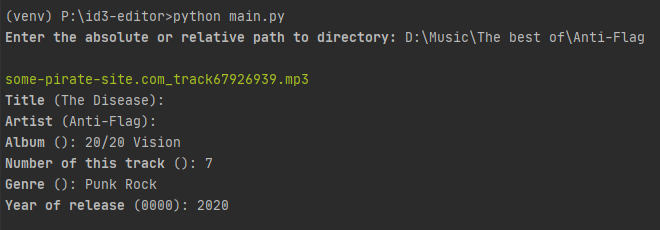
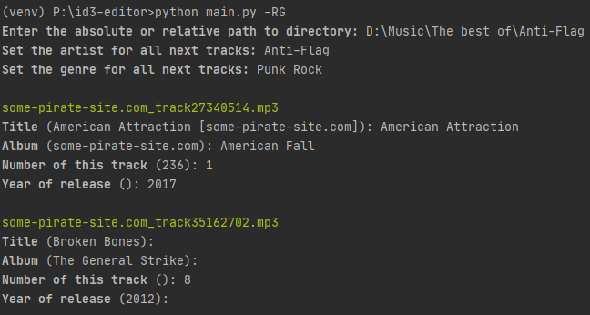

# ID3 Editor


[](README.md)<br>

**Простейшая консольная тулза для редактирования метаданных mp3 файлов в интерактивном режиме**

## 📦 Установка
Склонируй этот репозиторий, перейди в новую директорию и установи нужные пакеты:
```
$ git clone https://github.com/dan-sazonov/id3-editor.git
$ cd id3-editor
$ python3 -m pip install -r requirements.txt
```
_примечание: возможно потребуется ввести_ `python` _вместо_ `python3`.<br>
Эта программа была протестирована на Win10 x64 и Ubuntu 20.04 x64 на Python 3.9.0. Я не знаю, будет ли она хорошо работать 
на других ОС, поэтому будет круто, если ты поделишься своим опытом и расскажешь о найденных багах.

## ⚙ Применение
Самый простой способ запустить это:
```
$ python3 main.py
```
После этого программа спросит путь к директории, треки в которой надо отредактировать. Затем измени значение каждого параметра
для каждого файла. Если ты хочешь применить значение из скобок, просто нажми \[Enter\]. Это выглядит как-то так:

<p align="center"></p>

<h3>Параметры по дефолту</h3>

Если какие-то параметры одинаковые для всех треков в этой директории, ты можешь предустановить их указав соответствующие 
флаги перед запуском программы (см. ниже). Значение этих параметров будут спрошены однажды перед запуском и будут применены
ко всем трекам. Это выглядит как-то так:

<p align="center"></p>
<details> 
  <summary><b>Флаги:</b></summary>
  <ul>
    <li><code>'-T', '--title'</code> - задать название для всех треков;</li>
    <li><code>'-R', '--artist'</code> - задать исполнителя для всех треков;</li>
    <li><code>'-A', '--album'</code> - задать альбом для всех треков;</li>
    <li><code>'-N', '--number'</code> - задать номер для всех треков;</li>
    <li><code>'-G', '--genre'</code> - задать жанр для всех треков;</li>
    <li><code>'-D', '--date'</code> - задать дату выпуска для всех треков.</li>
  </ul>
</details>

<h3>Логирование и ручной режим</h3>

Если ты хочешь, ты можешь сохранить json лог с метаданными отредактированных файлов. Для этого запусти программу с флагами
`-l` или `--log`. По пути, сохраненному в переменной `LOG_PATH` в файле `config.py`, будет создан файл следуещего формата:
```json
{
  "file-name.mp3": {
    "data": ["value"]
  }
}
 ```
Ты можешь восстановить метаданные для треков по информации из любого лог-файла. Например, это может быть полезно если у
тебя есть одинаковые файлы в разных директориях, и нужно изменить метаданные для всех. Запусти программу с флагом `-p` или `--parse`,
выбери лог-файл и укажи путь целевой директории. Другие флаги, кроме `-r` или `--rename`, будут проигнорированы.
  
Также можно записать текущие метаданные в json файл. Для этого запусти программу с флагом `-s` или `--scan`. Я называю 
это **ручным режимом** - сначала ты создаешь файл с текущими метаданными, затем редактируешь его, и применяешь данные к
файлам, запустив программу с флагом `-p` or `--parse`.

<h3>Больше возможностей</h3>

- Если файлы содержат информацию о правообладателе, и ты хочешь сохранить ее, используй флаг `-c` или `--copyright`.
- Ты можешь запустить программу в минимальном режиме, используя флаг `-m` или `--minimal`. Будут спрошены только название, исполнитель, альбом и жанр. Другие данные будут очищены.
- Файлы могут быть переименованы по примеру `artist_track-title.mp3`. Используй флаг `-r` или `--rename`. Учти что информация в логах будет связана с новым названием.
- Можно переименовать файлы без изменения метаданных. Запусти программу с флагом `--auto_rename`. Не используй другие флаги с этим.
- Чтобы очистить все метаданные, используй флаг `-d` или `--delete`. Другие флаги будут проигнорированы.
- Если нужно вернуться к редактированию предыдущего файла в интерактивном режиме, введи символ `^` в любом поле.
- В интерактивном режиме два двоеточия после букв _a_, _o_ или _u_ будут заменены на эти буквы с умляутом. Например, `Mo::tley Cru::e` будет заменено на `Mötley Crüe`.
- Данные веденные пользователем будут проверены. Чтобы отключить валидацию, установи значение переменной `SKIP_VALIDATION` в файле `config.py` в `True`. Используй это осторожно!
- По дефолту в минимальном режиме год релиза и номер трека будут очищены. Чтобы оставить их, установи значение переменной `LEAVE_SOME_DATA` в файле `config.py` в `True`.
- Чтобы увидеть краткую справку, запусти программу с флагом `-h` или `--help`.

## 🤝 Совместная разработка
Если ты найдешь какие-то баги, пожалуйста, открой [issue](https://github.com/dan-sazonov/id3-editor/issues),
или сделай форк и предложи [пулл-реквест](https://github.com/dan-sazonov/id3-editor/pulls). И будет круто, если перед этим ты расскажешь мне про свои идеи, может быть я уже работаю над этим.
 
## 👨‍💻 Автор
Автор этого репозитория и кода - [@dan-sazonov](https://github.com/dan-sazonov). <br>
**Связаться со мной:**<br>
[✈️ Telegram](https://t.me/dan_sazonov) <br>
[📧 Email](mailto:p-294803@yandex.com) <br>
